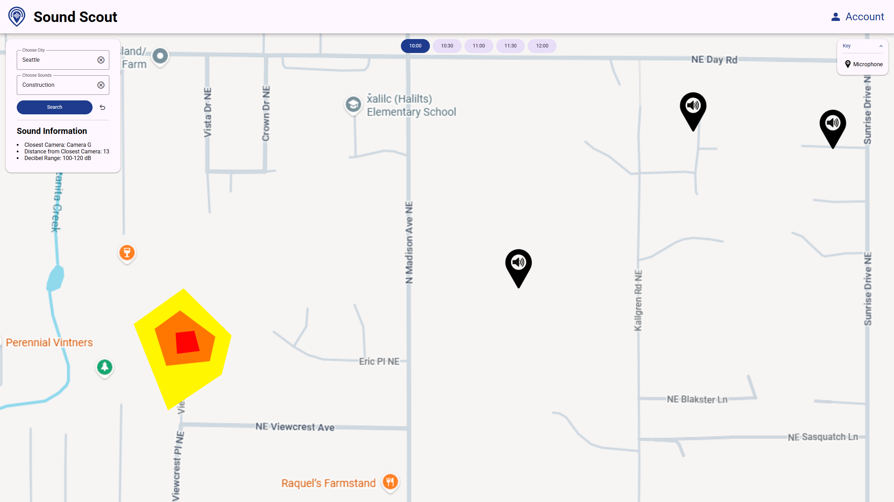
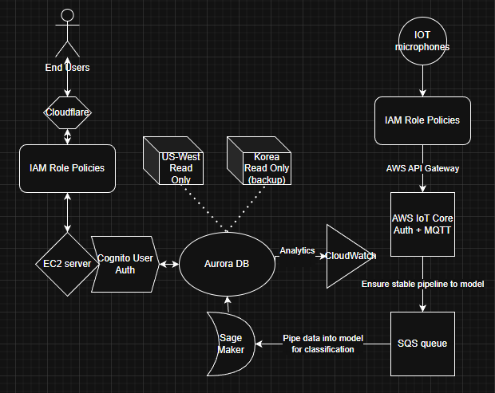

# Sound Scout

**Sound Scout** turns chaotic urban noise into clear, actionable information.

Cities are full of sounds that go unnoticed—traffic, construction, alarms, crowds—yet these sounds carry important signals about safety, livability, and activity. Sound Scout automatically classifies urban sounds and maps where they’re happening in near real time, helping communities, businesses, and individuals better understand their environments.

## What Sound Scout Does

Sound Scout collects audio from distributed microphones, applies machine learning to classify sound types, and visualizes the results on an interactive city map—without storing or replaying raw audio.

**Key problems we solve:**
* Urban noise is unstructured and hard to interpret
* Existing tools don’t provide accessible, location-based sound context
* Privacy concerns make traditional audio monitoring risky

**Our solution:**  
Sound awareness without surveillance.

## Core Features

* **Real-time sound classification**  
  Detects common urban sounds such as traffic, construction, alarms, and crowds.

* **Live sound map**  
  Displays classified sound events on a city grid with time and location context.

* **Filtering & exploration**  
  Filter sound events by type, time window, and geographic area.

* **Adaptable ML pipeline**  
  Designed to support new sound categories and different microphone types.

* **Privacy-first by design**  
  No raw audio playback or storage—only derived metadata.

* **Secure access**  
  User accounts and authentication for organizations that require controlled data access.

## Who It’s For

* **Residents & homebuyers**  
  Compare neighborhoods beyond price and crime—understand real-world noise patterns.

* **City officials & planners**  
  Gain situational awareness and identify disruptive or high-severity sound events.

* **Businesses & property managers**  
  Plan operations around predictable noise patterns and improve transparency.

* **Urban researchers & students**  
  Explore real-world applications of machine learning, IoT, and smart city systems.

## High-Level Architecture

Sound Scout is built as a modular, cloud-based system:

* Distributed **IoT microphones** stream audio securely
* **AWS services** handle ingestion, buffering, and classification
* **Machine learning models** classify sound events in near real time
* A **web interface** visualizes results on an interactive map

> The ML pipeline, backend services, and frontend UI are intentionally decoupled so models can evolve without breaking the user experience.

## Demos & Visuals

<!-- TODO: to add once built from draw.io -->

## Repositories

Sound Scout is split into multiple repositories for clarity and maintainability:

* **Sound Scout Web**

	Frontend web interface and user experience

	https://github.com/CS481-Sound-Scout-Group/Sound-Scout-Web

> Note: At the moment, all other code and infrastructure is hosted in AWS and is not public.

## Scope Notes

### In scope (v1):

* Real-time sound classification

* Live city map visualization

* Filtering by sound type, time, and location

* Web-based interface

### Out of scope (v1):

* Native mobile apps

* Automated emergency dispatch

* Predictive analytics

* Deep historical reporting

### Privacy & Ethics

Sound Scout is designed with pedestrian privacy as a core principle:

* No raw audio storage

* No playback of recorded sounds

* No speech recognition or conversation analysis

* Only anonymized metadata (time, location, sound type)

## Project Context

Sound Scout is a student-built system developed as part of an academic project focused on:

* Machine learning in real-world environments

* Scalable cloud architecture

* Ethical smart-city technology

## Contact

For questions, collaboration, or academic interest, please reach out via this GitHub organization.

---

### *Turning city noise into insight.*
